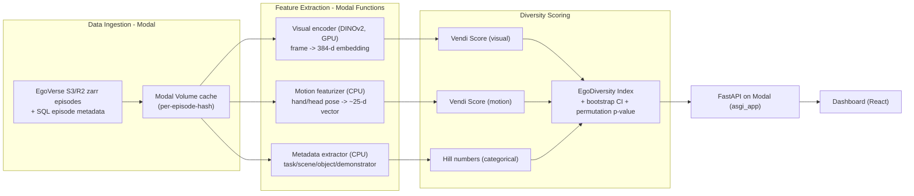

# EgoDiversity: Quantitative, Non-Text Diversity Scoring for EgoVerse

**Overview:** Build a reference-free, non-text diversity scoring system for EgoVerse egocentric robot-learning data, computed from visual, kinematic-motion, and metadata embeddings using the Vendi Score and Hill-number diversity indices (no LLM judge), with a Modal-powered compute pipeline and a comparison dashboard that ranks any two subsets with statistical confidence.

## Todos

- [x] Set up Modal app skeleton: App, Volume, Secret for EgoVerse AWS/DB creds
- [ ] Implement Modal function to pull filtered EgoVerse subsets via sync_s3.py/S3EpisodeResolver into a cached Volume
- [ ] Implement GPU Modal function: frame sampling + frozen DINOv2 embedding extraction per episode
- [ ] Implement CPU function: kinematic feature extraction from hand keypoints + head pose
- [ ] Implement metadata distribution extraction (task/scene/object/demonstrator) from SQL sidecar
- [x] Implement diversity/metrics.py: Vendi Score, Hill numbers, bootstrap CI, permutation test, composite index
- [ ] Build FastAPI /presets and /compare endpoints as a Modal asgi_app, with result caching
- [ ] Build React/Vite/Tailwind dashboard: subset selector, headline score card, axis breakdown chart, UMAP scatter, rarefaction curve, drill-down table
- [ ] Run demonstrator-count-scaling validation experiment replicating paper Fig 11/12 as a sanity check

---

## 1. Conceptual approach (why this beats LLM-as-judge)

LLM-as-judge diversity scoring has three structural problems: it's **expensive** (one API call per pairwise/set judgment, doesn't scale to thousands of episodes), **subjective** (score depends on prompt wording and judge model, not reproducible), and **text-biased** (an LLM judge has no native way to reason about hand kinematics, camera trajectories, or pixel-level scene variation — it can only judge diversity of a caption, which throws away almost all the signal in embodied data).

Our reframe: **diversity is the effective dimensionality (spread) of a population in a meaningful representation space** — not a subjective quality judgment. This is a well-established idea from ecology (Hill numbers / "effective number of species") and from generative-model evaluation (the **Vendi Score**, Friedman & Dieng 2023), which measures diversity as `exp(entropy of the eigenvalues of a similarity kernel)` over a set of items — completely reference-free, deterministic, and modality-agnostic (only needs a similarity function, not text).

We decompose EgoVerse diversity into three orthogonal, interpretable axes instead of one opaque number:

1. **Visual/scene diversity** — what the world looks like (frozen vision-encoder embeddings of sampled frames).
2. **Behavioral/motion diversity** — how hands and head move (kinematic feature vectors from 3D hand keypoints + 6-DoF head pose).
3. **Semantic-coverage diversity** — spread over task/scene/object/demonstrator categories (ecological Hill-number entropy over metadata, no embeddings needed).

These are combined into one **EgoDiversity Index** (weighted geometric mean, normalized by sample size so subsets of different sizes are comparable), but the dashboard always shows the breakdown so the score is explainable, unlike a black-box LLM rating.

Validation strategy: EgoVerse's own paper already shows (Fig. 11/12) that increasing demonstrator count increases generalization and that UMAP embeddings visually spread out more with more demonstrators. We replicate that experiment with our Vendi score as a sanity check — if our metric increases monotonically with demonstrator count on the same axis the paper studies, that's evidence the metric tracks real, expert-validated diversity, without ever calling an LLM.

## 2. Dataset access

### 2.0 EgoVerse integration strategy (do not install the full training repo)

The EgoVerse repo's own `requirements.txt`/`pyproject.toml` targets **policy training**, not data reading: it pulls in `torch`, `projectaria-tools[all]`, `mujoco`, `dm-control`, `mink`, `ray`, `hydra-core` + `hydra-submitit-launcher`, `lightning`, `scaleapi`, `openai`, etc. None of that is needed to compute a diversity score, and running `uv venv` / `uv pip install -r requirements.txt` locally does not help the Modal deployment anyway, since Modal builds its own container images independent of any local venv.

Instead:

- **Credentials (one-time, local, by hand):** clone EgoVerse just long enough to run `aws configure` (using the demo `AccessKeyId`/`SecretAccessKey` from the repo README) and `bash egomimic/utils/aws/setup_secret.sh`. Per `CONTRIBUTING_DATA.md`, this script tries the RL2-internal AWS Secrets Manager entries first and **automatically falls back to public, read-only DB (`rds/appdb/appuser-readonly`) and R2 (`r2/rldb/public/credentials`) secrets** if internal access is denied — so this one script works for external/hackathon use and yields both read-only Postgres metadata access and R2/S3 zarr access, written to `~/.egoverse_env`. Take that file's contents and create a `modal.Secret` from it (`modal secret create egoverse-creds ...`) so no container ever needs the AWS CLI or Secrets Manager access again.
- **Only one Modal function (`ingest_episodes`) imports EgoVerse code.** Its `modal.Image` installs the package with `--no-deps` (skipping the whole training/sim dependency tree) plus the handful of light packages the data-access path actually needs (traced through `aws_sql.py` → `aws_data_utils.py` → `filters.py` → `zarr_dataset_multi.py` → `embodiment.py`): `numpy`, `torch`, `zarr==3.1.5`, `boto3`, `cloudpathlib`, `sqlalchemy`, `psycopg[binary]`, `pandas`, `simplejpeg`. From there we reuse `DatasetFilter`, `create_default_engine`, `episode_table_to_df`, and `TableRow` to resolve matching episodes and download their `.zarr` stores from R2 into a `modal.Volume`, cached by `episode_hash`.
- **Every other function** (visual embeddings, motion features, Vendi scoring, FastAPI) uses a separate, slim image and only reads the already-downloaded `.zarr` files directly with `zarr`/`numpy`/`torch` — no EgoVerse import, no MuJoCo/Ray/Hydra/Lightning bloat, faster cold starts.
- We do **not** hand-copy EgoVerse source files into our repo; we depend on the real package (pinned to a commit) via `pip install git+https://github.com/GaTech-RL2/EgoVerse.git@<commit>` so we track their schema (e.g. the mandatory-intrinsics change) instead of silently drifting from it.

EgoVerse (`GaTech-RL2/EgoVerse`) stores each episode as a Zarr store (`images.front_1`, `left/right.obs_ee_pose`, `obs_head_pose`, optional `*.obs_keypoints`, `annotations`, `intrinsics` in `zarr.json`), indexed by a Postgres `app.episodes` table with columns `episode_hash, lab, task, embodiment, rig_name, task_description, scene, objects, num_frames, zarr_processed_path`. Access is via:

- `egomimic/scripts/data_download/sync_s3.py --local-dir <dir> --filters <preset>` (uses `DatasetFilter` lambdas over the SQL row, e.g. `embodiment == 'aria'`, `task == 'fold_clothes'`) — this is our primary ingestion mechanism, run inside a Modal function.
- AWS + DB credentials configured per the repo's `CONTRIBUTING_DATA.md` / `setup_secret.sh` (stored as a **Modal Secret**, never hardcoded in our code).

We use these existing filters to define natural, non-cherry-picked **comparison subsets**, exposed as dropdown options in the dashboard, e.g.:

- `aria-fold-clothes` (academic, controlled rig) vs `mecka-fold-clothes` (industry, in-the-wild rig) — same task, different capture source.
- EgoVerse-A vs EgoVerse-I style split (`lab` field).
- Demonstrator-count scaling subsets (N=4 vs N=12 demonstrators in one scene) — direct replication of the paper's Fig. 11/12 diversity-scaling study, as a built-in validation preset.

To control cost, we sample a configurable N episodes per subset (default ~150-300) rather than pulling all ~80k episodes.

## 3. Feature extraction (Modal functions)

**`extract_visual_embeddings` (GPU function, `gpu="T4"`)**

- Per episode: uniformly sample K=8 frames from `images.front_1`.
- Encode with a frozen **DINOv2 ViT-S/14** (via `transformers`/`torch.hub`, no fine-tuning, no LLM) → 384-d CLS embedding per frame.
- Mean-pool frames → one 384-d "visual fingerprint" per episode.
- Parallelized via `.map()` across episodes; results cached to a Modal Volume keyed by `episode_hash` so re-running comparisons never recomputes embeddings for an episode already seen.

**`extract_motion_features` (CPU function)**

- From `obs_head_pose` (6-DoF trajectory) and hand keypoints (`21kp x 2 hands` or `obs_ee_pose`): compute a fixed ~25-dim descriptor per episode — path length, net displacement, mean/peak linear & angular velocity, jerk, hand-workspace convex-hull volume, bimanual velocity correlation, gaze/head-orientation variance.
- Z-score normalized across the comparison pool at scoring time.

**`compute_metadata_distributions` (CPU function)**

- Pull `task`, `scene`, `objects`, `operator` (demonstrator), `lab`/`rig_name` per episode from the SQL sidecar; build per-subset frequency tables.

## 4. Diversity metrics library (`diversity/metrics.py`, pure numpy — runs as a Modal function or locally)

- `vendi_score(embeddings, q=1)`: cosine-similarity kernel `K` (trace-normalized), eigen-decompose, `VS = exp(-sum(λ_i log λ_i))`. Implemented from the published Vendi Score formulation (Friedman & Dieng, 2023) — deterministic, no learned judge.
- `hill_number(category_counts, q=1)`: `exp(Shannon entropy)` over a categorical distribution — used for task/scene/object/demonstrator coverage.
- `bootstrap_ci(score_fn, items, n_boot=1000)`: resample-with-replacement → (mean, 2.5%, 97.5% CI) per subset.
- `permutation_test(a_items, b_items, n_perm=2000)`: label-shuffle test → p-value for "subset A is more diverse than subset B" — this replaces the LLM judge's subjective verdict with a statistically grounded one.
- `composite_index(visual_vs, motion_vs, task_hill, scene_hill, object_hill, demographic_hill, weights)`: weighted geometric mean, each term normalized by its own theoretical max (≈ sample size `n`) so the index is comparable across subsets of different sizes — reported as "% of maximum attainable diversity."

## 5. Orchestration & API (Modal)

Single `modal.App("egodiversity")` with:

- `modal.Secret` for AWS/DB creds, `modal.Volume` for the episode cache + embedding cache, `modal.Dict` (or a small SQLite/JSON file on the volume) for memoizing per-subset comparison results keyed by `(filter_a, filter_b, n, seed)`.
- Pipeline functions from Section 3-4, chained via `.spawn()`/`.map()` calls.
- `@modal.asgi_app()` FastAPI backend exposing:
  - `GET /presets` — list available subset filters.
  - `POST /compare` — `{subset_a, subset_b, n}` → runs (or fetches cached) pipeline → returns JSON: per-subset composite index, per-axis breakdown, CI, p-value, and 2D UMAP coordinates (computed with `umap-learn`, colored by subset) for the visual and motion embedding scatter plots.

This design keeps GPU spend minimal against the $301 credit: DINOv2-S inference on a few hundred episodes × 8 frames is on the order of a few GPU-minutes on a T4, and embeddings are cached permanently per `episode_hash`, so exploring many subset combinations in the dashboard costs compute once per unique episode, not once per comparison.

## 6. Dashboard (frontend)

React + TypeScript + Vite + Tailwind, calling the Modal FastAPI endpoint (deployed separately, e.g. Vercel, or served directly as static files from the Modal ASGI app):

- **Subset selector**: two dropdowns/filter builders (task, lab/rig, embodiment, demonstrator-count slider) + "Compare" action.
- **Headline card**: EgoDiversity Index for A vs B, winner badge, bootstrap CI, permutation-test p-value ("Subset A is more diverse, p = 0.008").
- **Axis breakdown**: bar/radar chart of the six sub-scores (visual Vendi, motion Vendi, task/scene/object/demonstrator Hill numbers) for A vs B side by side — makes the score interpretable instead of a black box.
- **Embedding scatter**: 2D UMAP projection of visual and motion embeddings, points colored by subset — visual evidence for *why* one subset scores higher (recreates the paper's own Fig. 12 diversity visualization).
- **Rarefaction curve**: Vendi score vs. sample size for both subsets (ecology-style diversity-accumulation curve), showing whether the ranking is stable as N grows.
- **Drill-down table**: per-episode thumbnails + metadata for manual inspection.
- **Cost/latency panel**: Modal compute time and $ cost for the comparison, directly contrasting with the cost profile of an LLM-judge pipeline.

## 7. Validation experiment

Reproduce the paper's demonstrator-diversity-scaling setup (fixed scene, demonstrator count ∈ {4, 8, 12}) and confirm our composite index increases monotonically with demonstrator count — cited in-dashboard as a "sanity check against ground truth" panel, giving the judges independent confidence the metric is measuring something real, not an artifact.

## Tech stack summary

- **Compute/orchestration**: Modal (`modal.App`, GPU functions `gpu="T4"`, `modal.Volume` for episode + embedding cache, `modal.Secret` for AWS/DB creds, `modal.Dict`/volume-backed cache for comparison results, `@modal.asgi_app()` for the API).
- **Data access**: EgoVerse's own `sync_s3.py` / `S3EpisodeResolver` + SQLAlchemy/Postgres episode table, `zarr` for reading episode stores.
- **ML/feature extraction**: PyTorch + frozen DINOv2 (via `transformers`), numpy for kinematic feature engineering.
- **Diversity math**: hand-rolled `diversity/metrics.py` (Vendi Score, Hill numbers, bootstrap, permutation test) — no ML training required.
- **Dimensionality reduction for viz**: `umap-learn` / `scikit-learn` PCA.
- **Backend API**: FastAPI, mounted via Modal's `asgi_app`.
- **Frontend**: React + TypeScript + Vite + Tailwind CSS + a charting lib (Recharts) for bar/radar/scatter plots.

## Suggested repo layout

- `egodiversity/data/` — Modal functions for S3/SQL ingestion + episode caching.
- `egodiversity/features/` — visual (DINOv2) and motion feature extractors.
- `egodiversity/metrics/` — Vendi Score, Hill numbers, bootstrap/permutation stats.
- `egodiversity/app.py` — Modal `App` definition wiring everything + FastAPI `asgi_app`.
- `dashboard/` — React/Vite frontend.
